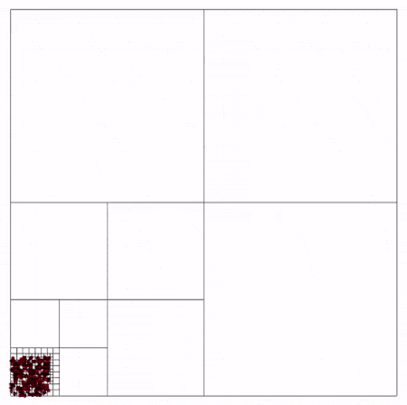

# BurstCollections

[](https://github.com/andywiecko/BurstCollections/actions/workflows/test.yml)
[](https://openupm.com/packages/com.andywiecko.burst.collections/)

Burst friendly (special) native collections for Unity.

- [BurstCollections](#burstcollections)
  - [Getting started](#getting-started)
  - [Native2dTree](#native2dtree)
  - [NativeAccumulatedProduct{T, Op}](#nativeaccumulatedproductt-op)
  - [NativeArray2d{T}](#nativearray2dt)
  - [NativeBoundingVolumeTree{T}](#nativeboundingvolumetreet)
  - [NativeIndexedArray{Id, T}](#nativeindexedarrayid-t)
  - [NativeIndexedList{Id, T}](#nativeindexedlistid-t)
  - [NativePointQuadtree](#nativepointquadtree)
  - [NativeStack{T}](#nativestackt)
  - [NativeStackedLists{T}](#nativestackedlistst)
  - [Dependencies](#dependencies)
  - [TODO](#todo)

## Getting started

Install the package using one of the following methods

<details open>
<summary> Using scoped registry <b>(recommended)</b> </summary>
Use OpenUPM CLI or add corresponding entries to the project's <code>manifest.json</code> manually.
Add or modify scoped registries in the manifest
<pre>
  "scopedRegistries": [
    {
      "name": "OpenUPM",
      "url": "https://package.openupm.com/",
      "scopes": [
        "com.andywiecko"
      ]
    }
  ]
</pre>
and in the dependencies provide selected version of the package
<pre>
"dependencies": {
    "com.andywiecko.burst.collections": "1.7.1",
    ...
</pre>
See Unity docs for more details https://docs.unity3d.com/2021.1/Documentation/Manual/upm-scoped.html
</details>

<details>
<summary> <code>git</code> install </summary>
Use package manager via git install: https://github.com/andywiecko/BurstCollections.git#v1.7.1
</details>

<details>
<summary> Manual instalation </summary>
Clone or download this repository and then select <code>package.json</code> using Package Manager (<code>Window/Package Manager</code>).
</details>

## Native2dTree

The package supports basic implementation of [_k_-d tree](https://en.wikipedia.org/wiki/K-d_tree) for _k_=2.
The following structure is especially useful for range searches and nearest neighbor queries.

Example usage:

```csharp
using var result = new NativeList<int>(64, Allocator.Persistent);
using var tree = new Native2dTree(6, Allocator.Persistent);
using var positions = new NativeArray<float2>(new float2[]
{
  new(7, 2), new(5, 4), new(9, 6), new(2, 3), new(4, 7), new(8, 1)
}, Allocator.Persistent);

tree.Construct(positions);

// Expected result: (2, 3), (5, 4)
tree.RangeSearch(range: new AABB(0, 6), positions, result); 
```

Currently, only `RangeSearch` with `AABB` range is implemented.
Below one can find performance benchmark for the structure (tested on Intel i7-4790K @ 4GHz).


An advanced usage of 2d-tree can be found at [**Flocking**](https://github.com/andywiecko/Flocking) repository.

## NativeAccumulatedProduct{T, Op}

A wrapper which is especially useful for parallel calculation of the abelian operators, e.g. sum, min, max.
Generic parameter `Op` must implement the `IAbelianOperator<T>` interface

```csharp
public interface IAbelianOperator<TSelf> where TSelf : unmanaged
{
  TSelf Product(TSelf a, TSelf b);
  TSelf NeturalElement { get; }
}
```

Consider the following example

```csharp
var values = Enumerable.Range(0, 1024 * 1024).ToArray();
using var data = new NativeArray<int>(values, Allocator.Persistent);
using var product = new NativeAccumulatedProduct<int, IntSum>(Allocator.Persistent);

JobHandle dependencies = default;

dependencies = product.AccumulateProducts(data.AsReadOnly(), innerloopBatchCount: 64, dependencies).
dependencies = product.Combine(dependencies);

dependencies.Complete();

Debug.Log(product.Value); // Expected: 0 + 1 + 2 + ... + (1024 * 1024 - 1).
```

In the example presented above, we first, allocate the array with numbers: 0, 1, 2, 3, ..., then
we allocate buffers for accumulated products and we chose the `IntSum` operation.
Then after jobs completion, we obtain the sum of all elements, which
was done in **parallel**.

Supported operations:

- `int/int2/int3/int4`: `Int(2/3/4)Sum`, `Int(2/3/4)Min`, `Int(2/3/4)Max`,
- `float/float2/float3/float4`: `Float(2/3/4)Sum`, `Float(2/3/4)Min`, `Float(2/3/4)Max`,
- `AABB`: `AABBUnion`.

## NativeArray2d{T}

Wrapper for two-dimensional `NativeArray<T>` (matrix 2d).
Matrix elements are stored in the same notation as in C# two-dimensional arrays, example

```csharp
int[,] managed =
{
  {0, 1, 2 },
  {3, 4, 5 },
  {6, 7, 8 },
  {9, 10, 11 }
};
var array = new NativeArray2d<int>(managed, Allocator.Persistent);

// Element access
array[0, 0] = 100;
var b = array[1, 1];

// Row access
var row = array.GetRow(1);
foreach(var i in row)
{
  Debug.Log(i); // Expected: 3, 4, 5
}

array.Dispose();
```

## NativeBoundingVolumeTree{T}

A bounding volume tree is a data structure that is especially useful as supporting operations during collision detection or ray tracing algorithms.
Briefly, it allows reducing the number of checks from _O(n²)_ to _O(nk)_.

`NativeBoundingVolumeTree{T}` requires that generic parameter `T` implements the `IBoundingVolume<TSelf>` interface.
Currently, the package provides the following implementations

- `AABB` –⁠ [axis-aligned bounding box][aabb] (two dimensional),
- `MBC` –⁠ [minimum bounding circle][mbc].

**Note:** AABB 3d is easy to implement by changing `float2` to `float3` in AABB (2d).

**Example usage**

To work with the tree one has to allocate native data by declaring the number of leaves (i.e. number of bounding volume objects from which tree will be constructed):

```csharp
var tree = new NativeBoundingVolumeTree<AABB>(leaves: 10, Allocator.Persistent);
var volumes = new NativeArray<AABB>(10, Allocator.Persistent);
```

Then to construct the tree (which could be injected into the Unity jobs pipeline with the given `JobHandle dependencies`).
Currently, there is support only for incremental construction of the tree

```csharp
tree.Construct(volumes.AsReadOnly());
```

When the volumes are static (over time) then this is it.
Traverse the tree using _Breadth First Search_ to optimize your algorithms...

```csharp
var bfs = tree.BreadthFirstSearch();
foreach (var (id, nodeAABB) in bfs)
{
  bfs.Traverse(id);
}
```

...or you could use the provided extension in the package to collect all intersections with the given `AABB aabb`

```csharp
tree.GetIntersectionsWithAABB(aabb, result);
```

The package provides also intersections between two trees:

```csharp
using var tree1 = new NativeBoundingVolumeTree<AABB>(10, Allocator.Persistent);
using var tree2 = new NativeBoundingVolumeTree<AABB>(10, Allocator.Persistent);
using var result = new NativeList<int2>(64, Allocator.Persistent);

// ...

tree1.GetIntersectionsWithTree(tree2, result);
```

The result is stored in a list of `int2` where `int2.x` and `int2.y` correspond to `tree1` and `tree2` leaf index respectively.

In the case when your objects are not static, you have to update the leaves volumes during your simulation (you could inject this into the Unity jobs pipeline as well)

```csharp
tree.UpdateLeavesVolumes(volumes);
```

The tree supports also `ReadOnly` substruct, which could be used especially while working with parallel jobs

```csharp
using var tree = new NativeBoundingVolumeTree<AABB>(4, Allocator.Persistent);
var readOnly = tree.AsReadOnly(); 
```

Remember to dispose of all native data related to the tree:

```csharp
tree.Dispose();
volumes.Dispose();
```

To summarize below one can find the MWE

```csharp
var tree = new NativeBoundingVolumeTree<AABB>(leavesCount: 4, Allocator.Persistent);
var volumes = new NativeArray<AABB>(4, Allocator.Persistent);

tree.Construct(volumes.AsReadOnly());

// ...

tree.UpdateLeavesVolumes(volumes);

var aabb = new AABB(0, 1);
var result = new NativeList<int>(4, Allocator.Persistent);
tree.GetIntersectionsWithAABB(aabb, result)

// ...

tree.Dispose();
volumes.Dispose();
result.Dispose();
```

**Note:** the current implementation of the tree does not contain the `Optimize()` method as a consequence it is recommended to use the tree only for consistent structures (like the ones presented in the [Results](#results) section).

**Results**

Below one can find an example result of the constructed `NativeBoundingVolumeTree{T}` for `AABB` and `MBC`, respectively.
The tree was constructed from triangle mesh marked with blue.
On each frame of the `.gif` animations, one can see the contours of the bounding volumes for the given tree level.

Traversing bounding volume tree made of AABB:


Traversing bounding volume tree made of MBC:


**Note:** the triangle mesh was obtained using the related package: [**BurstTriangulator**](https://github.com/andywiecko/BurstTriangulator).

## NativeIndexedArray{Id, T}

Wrapper for `NativeArray<T>` which supports indexing via `Id<T>` instead of `int`, where `T` is a non-constraint generic parameter.
The collection is useful for enumeration of the specifically listed objects like triangles, circles, points, etc., and their properties.
Using `Id` could protect from errors related to reading from nonrelated buffer with the given type of objects.
Consider the following struct

```csharp
public readonly struct Triangle { /* ... */ }
```

Then using the `NativeIndexedArray` one can prepare the following collections
to group some triangle properties.

```csharp
using var triangles = new NativeIndexedArray<Id<Triangle>, Triangle>(128, Allocator.Persistent);
using var areas = new NativeIndexedArray<Id<Triangle>, float>(128, Allocator.Persistent);
using var neighborsCount = new NativeIndexedArray<Id<Triangle>, int>(128, Allocator.Persistent);
```

To access the elements one has to use `Id<Triangle>` instead of `int`

```csharp
var triangleId = (Id<Triangle>)42;

var triangle = triangles[triangleId];
var area = areas[triangleId];
var neighborCount = neighborsCount[triangleId];
```

`NativeIndexedArray<Id, T>` can be enumarated by using values, ids or id–value tuples:

```csharp
using var data = new NativeIndexedArray<Id<int>, int>(new[]{1, 42, 6}, Allocator.Persistent);

foreach (var value in data)
{
  UnityEngine.Debug.Log(value); 
} // Expected: 1, 42, 6.

foreach (var id in data.Ids)
{
  UnityEngine.Debug.Log(id); 
} // Expected: (Id<int>)0, (Id<int>)1, (Id<int>)2.

foreach (var (id, value) in data.IdsValues)
{
  UnityEngine.Debug.Log($"{id}, {value}"); 
} // Expected: ((Id<int>)0, 1), ((Id<int>)1, 42), ((Id<int>)2, 6).
```

## NativeIndexedList{Id, T}

Wrapper for `NativeList<T>` which supports indexing via `Id<T>` instead of `int`, where `T` is a non-constraint generic parameter.
See [NativeIndexedArray{Id, T}](#nativeindexedarrayid-t) for more details.

## NativePointQuadtree

The package provides the basic implementation of a [quadtree](https://en.wikipedia.org/wiki/Quadtree) (for points). Similar to the bounding volume tree, the quadtree can be used for computation acceleration.
An example of usage can be found below

```csharp
using var tree = new NativePointQuadtree(bounds: new(0, 10), treeCapacity: 64, nodeCapacity: 1, Allocator.Persistent);
var points = new[]{ math.float2(0, 1), math.float2(5, 5), math.float2(3, 2) };
tree.Build(points); // pass JobHandle here to add this to jobs pipeline.
```

There is availible AABB range query for the `NativePointQuadtree`

```csharp
using var result = new NativeList<int>(64, Allocator.Persistent);
tree.AsReadOnly().RangeSearch(range: new(0, 3), points, result);
```

> **Warning**
>
> `NativePointQuadtree` does not support for points degeneracy!
> Provided input must contain distinct collection of points.

In the figure, one can find a schematic representation of the quadtree (generated using the package) for moving particles in the box with periodic boundary conditions.



## NativeStack{T}

Simple implementation of the stack data structure.

Example usage:

```csharp
var stack = new NativeStack<int>(capacity: 10, Allocator.Persistent);

stack.Push(0);
stack.Push(1);
stack.Push(2);

while(stack.TryPop(out var item))
{
    UnityEngine.Debug.Log(item);
} // Expected logs: 2, 1, 0

stack.Dispose();
```

Remarks: implementation probably will be deprecated in the future, when Unity team add stack implementation to `Unity.Collections`.

## NativeStackedLists{T}

The problem with the current version of `Unity.Collections` is that the nested collections are not allowed (e.g. `NativeArray<NativeArray<T>>`) except the _unsafe_ context.
The `NativeStackedLists` is combination of stack and lists.
One could add elements to the list but only for the top one in the stack.
Example:

```csharp
using var stackedLists = new NativeStackedLists<int>(64, 4, Allocator.Persistent);

stackedLists.Push(); // Add new list to the stack
stackedLists.Add(4); // Add elements
stackedLists.Add(5);
stackedLists.Add(6);

stackedLists.Push(); // Add new list to the stack
stackedLists.Add(8); // Add elements
stackedLists.Add(9);

// stacked list is equivalent of the following collection:
// {{4, 5, 6}, {8, 9}}
```

Adding the new elements is restricted only for the top list, however, one could get/set element for any list in the stack:

```csharp
var list0 = stackedLists[0]; // type of NativeArray<T> with read/write access
var list1 = stackedLists[1];
```

There are also implemented a proper enumerators for `foreach` statements:

```csharp
foreach(var list in stackedLists)
{
  foreach(var i in list)
  {
    // ...
  }
}
```

## Dependencies

- [`Unity.Burst`][burst]
- [`Unity.Mathematics`](https://docs.unity3d.com/Packages/com.unity.mathematics@1.2/manual/index.html)
- [`Unity.Collections`](https://docs.unity3d.com/Packages/com.unity.collections@1.1/manual/index.html)
- [`Unity.Jobs`][jobs]

## TODO

- [ ] Implement `.Optimize()` for `BoundingVolumeTree{T}`,
- [ ] Implement `Depth-first search` for `BoundingVolumeTree{T}`,
- [ ] Implement `DynamicBoundingVolumeTree{T}`,
- [ ] Implement `NativeGrid` (2d/3d),

[aabb]:https://en.wikipedia.org/wiki/Axis-aligned_bounding_box
[mbc]:https://en.wikipedia.org/wiki/Minimum_bounding_circle
[burst]:https://docs.unity3d.com/Packages/com.unity.burst@1.7/manual/index.html
[jobs]:https://docs.unity3d.com/Packages/com.unity.jobs@0.11/manual/index.html
